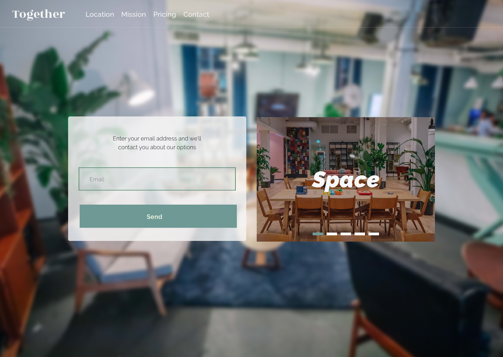
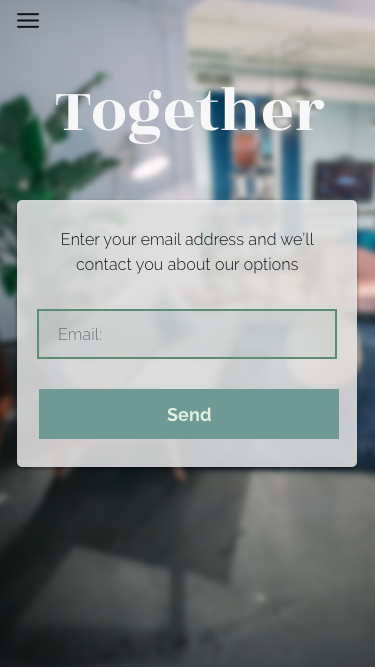
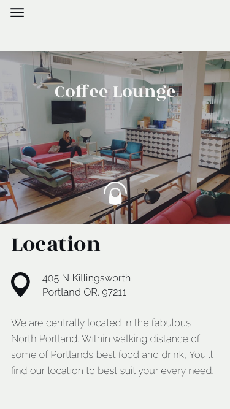
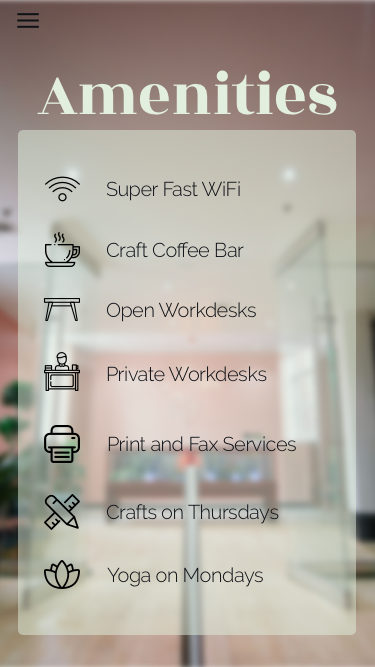
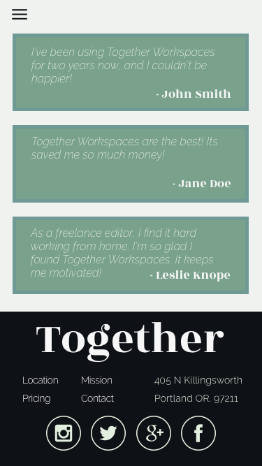

## Co-Workspace Client Site
---

#### By Bobby Martin
#### 6.1.18

### Description

This UI solo project represents obtained knowledge gained from the last week of the UI track. It shows the use of pencil and paper sketching, building wireframes and prototypes with Sketch App, and more advanced CSS topics

### Discovery Phase
I took some inspiration from existing co-work websites and mainly found a lot of type that represents the company. Their sites use words like "Easy", "Space", "All Encompassing", "Location". They both have a call to action near the top of the front page. I think having a contact form might be beneficial, something easy to use to get a quick response back.

So I decided to make a words list of my own to show how I want to represent this clients needs. I want to use similar words like "Easy", "Space", "Welcoming", "Elegant", "Flexible", "Creative", and "Location", to represent the clients "slightly luxurious, cool, and high-end; yet still absolutely 100% welcoming, approachable" desires.

I'll be using a similar color palette to the colors used in the clients workspace environment. More pastel/bold colors, thin lines, foliage/print type styles. Keeping it more on the minimal side, but not pretentious or uninviting, still "fun and welcoming".

### Images

#### Desktop Version

#### Mobile Version

### Technologies and Resources

* Sketch
* Webpack
* SCSS

### Responsiveness

### Setup Instructions

* Clone this repo
* Once cloned on your local machine, **Run `npm install` to install all necessary dependencies**
* Once dependencies have been installed, **Run `npm start` to start the development environment**

### Roadmap

<!-- Is there work you plan on continuing doing on this project? Features you'd like to add?

* Consider
* Listing
* Them
* Here -->

### License

This project uses the **_MIT License_**

Copyright &copy; 2018 **Bobby Martin**
